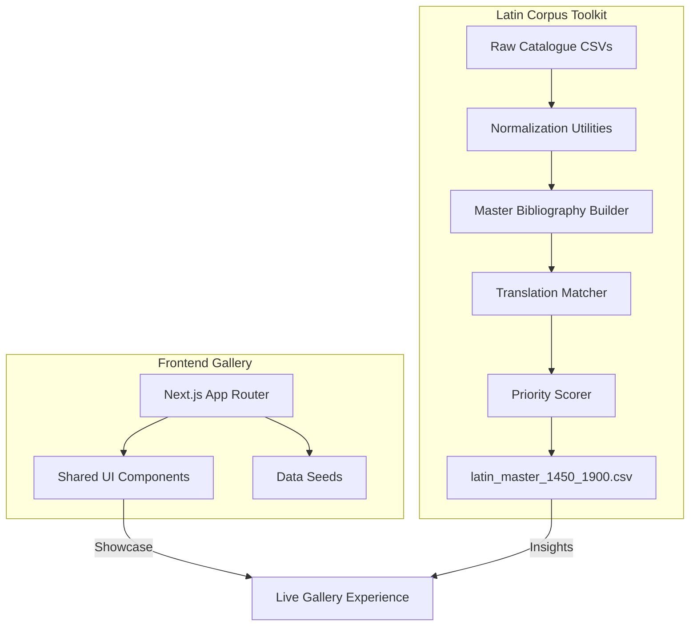

# CodeVibing

CodeVibing is a hybrid workspace that pairs a visual gallery of AI-generated React components with a research-grade Latin bibliography toolkit. The project combines a shareable Next.js playground for creative coding with a Python pipeline for constructing a master catalogue of Latin works (1450–1900).



## Repository Structure

```
codevibing/
├── src/                  # Next.js application source
├── public/               # Static assets for the gallery
├── latin_corpus/         # Python toolkit for the Latin master bibliography
├── notebooks/            # Prototyping notebooks for dataset exploration
├── package.json          # Frontend dependencies
└── requirements.txt      # Python dependencies for the toolkit
```

## Frontend Quick Start

1. **Install dependencies**
   ```bash
   npm install
   ```

2. **Configure environment variables**
   ```bash
   cp .env.example .env.local
   # Edit .env.local and add any required API keys
   ```

3. **Run the development server**
   ```bash
   npm run dev
   ```

   Visit <http://localhost:3000> to explore the gallery.

## Latin Corpus Toolkit Overview

The toolkit in `latin_corpus/` assembles catalogue exports, flags digitization and translation coverage, and scores works for follow-up research.

### Prerequisites

```bash
cd latin_corpus
python -m venv .venv
source .venv/bin/activate   # On Windows: .venv\Scripts\Activate.ps1
pip install -r requirements.txt
```

### Workflow

1. Place catalogue exports (USTC, VD16/17/18, ESTC, etc.) and translation series CSVs in `latin_corpus/data/raw/`.
2. Run the end-to-end builder:
   ```bash
   python -m latin_corpus.main
   ```
3. Inspect the generated master table at `latin_corpus/data/processed/latin_master_1450_1900.csv`.

See [latin_corpus/README.md](latin_corpus/README.md) for detailed customization options, column mappings, and troubleshooting tips.

## Publishing Your Own Copy to GitHub

If you started from a local folder and want to push it to a new GitHub repository, follow these steps:

1. Create an empty repository at <https://github.com/new>.
2. Run the following commands from your project directory (replace the URL with your repo):
   ```bash
   git init
   git remote add origin https://github.com/<your-username>/codevibing.git
   git add .
   git commit -m "Initial commit"
   git branch -M main
   git push -u origin main
   ```
3. Verify the remote:
   ```bash
   git remote -v
   ```
4. Clone elsewhere when needed:
   ```bash
   git clone https://github.com/<your-username>/codevibing.git
   ```

## Contributing

We welcome improvements! Please read [CONTRIBUTING.md](CONTRIBUTING.md) for contribution guidelines.

## License

This project is licensed under the MIT License. See [LICENSE](LICENSE) for details.
