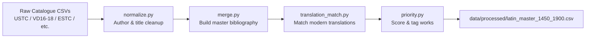

# Latin Corpus Toolkit

This toolkit assembles disparate catalogue exports into a unified master bibliography of Latin works published between roughly 1450 and 1900. It normalizes metadata, flags digitized editions and modern translations, and assigns a configurable research priority score.

## Pipeline at a Glance



Each stage uses pandas DataFrames and can be customized through configuration dictionaries and helper functions.

## Directory Layout

```
latin_corpus/
├── data/
│   ├── raw/         # Drop catalogue & translation CSV/TSV exports here
│   └── processed/   # Generated outputs (e.g., latin_master_1450_1900.csv)
├── latin_corpus/    # Python package with the normalization/merge pipeline
├── notebooks/       # Optional Jupyter notebooks for exploration
└── requirements.txt # Toolkit-specific dependencies
```

## Quick Start

1. **Create a virtual environment and install dependencies**
   ```bash
   cd latin_corpus
   python -m venv .venv
   source .venv/bin/activate      # On Windows: .venv\Scripts\Activate.ps1
   pip install -r requirements.txt
   ```

2. **Stage your source data**
   * Copy catalogue exports (USTC, VD16/VD17/VD18, ESTC, national catalogues, etc.) into `data/raw/`.
   * Add translation spreadsheets (Loeb, I Tatti, Brill, or custom lists) to the same folder.

3. **Run the end-to-end build**
   ```bash
   python -m latin_corpus.main
   ```
   The script prints progress summaries and writes `data/processed/latin_master_1450_1900.csv`.

## Configuring Inputs

* **Column mappings:** The loader functions in `io_utils.py` accept optional dictionaries for renaming columns when catalogue exports use different headings.
* **Language filtering:** `merge.py` includes a `LANGUAGE_ALLOWED` configuration block—add or remove variants as needed (e.g., `"lat"`, `"Latin"`).
* **Translation files:** Adjust the `TRANSLATION_SERIES` list near the top of `latin_corpus/main.py` if your filenames differ or you want to add additional translation datasets.
* **Fuzzy matching:** `translation_match.py` exposes `MATCHING_CONFIG` for enabling/disabling fuzzy title similarity and tuning thresholds.

## Inspecting Results

You can explore the master bibliography interactively using the provided notebook:

```bash
jupyter notebook notebooks/build_master_example.ipynb
```

Within the notebook, import and call:

```python
from latin_corpus.merge import build_master_bibliography
master_df = build_master_bibliography()
master_df.head()
```

## Troubleshooting

* Install pandas and related dependencies if you see a `MissingDependencyError` from `_compat.py`.
* Verify filenames and encodings for any CSV/TSV that fails to load; the loaders accept both UTF-8 and Latin-1.
* Delete or move old outputs in `data/processed/` if you want to regenerate the master CSV from scratch.

## Contributing

Pull requests and issue reports are welcome. Please follow the repository-wide [CONTRIBUTING.md](../CONTRIBUTING.md) guidelines when proposing changes.
