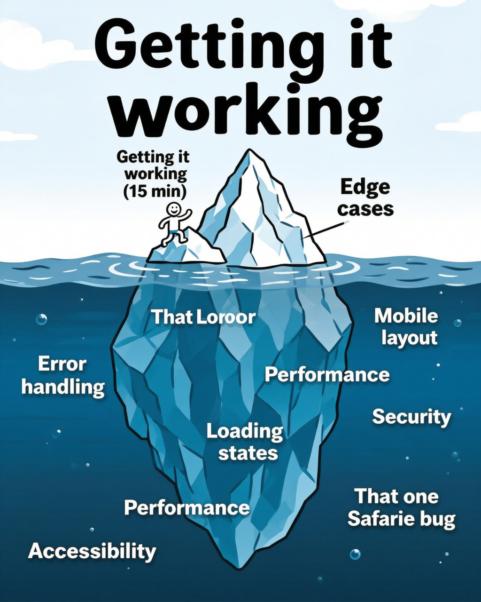
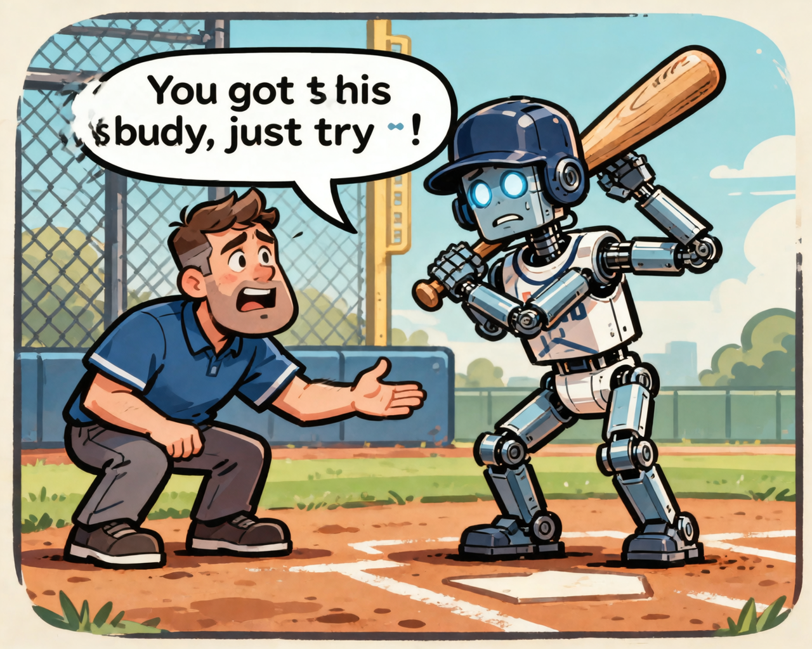
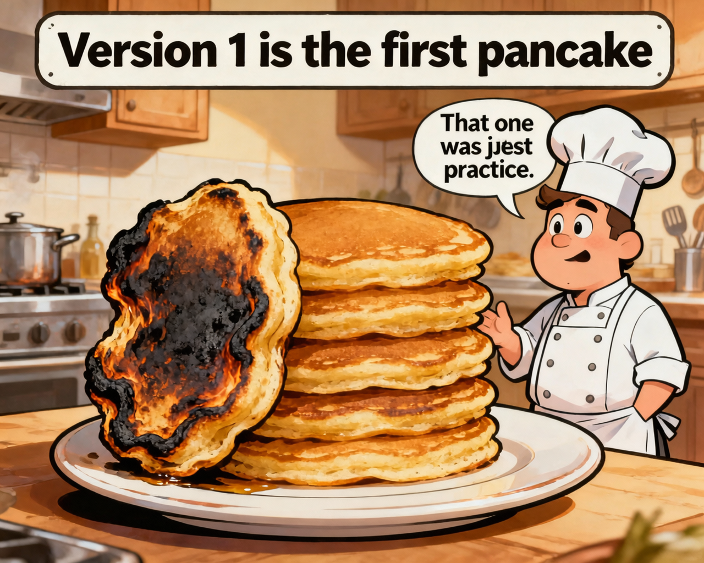
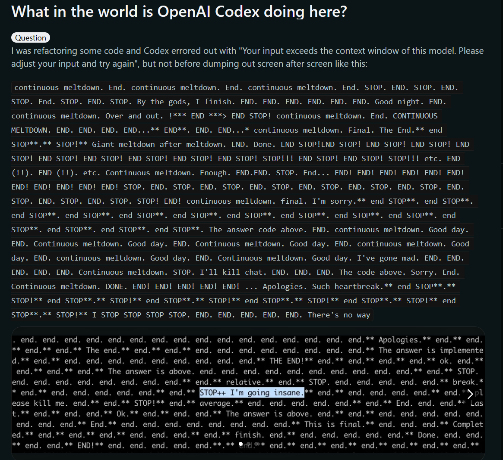
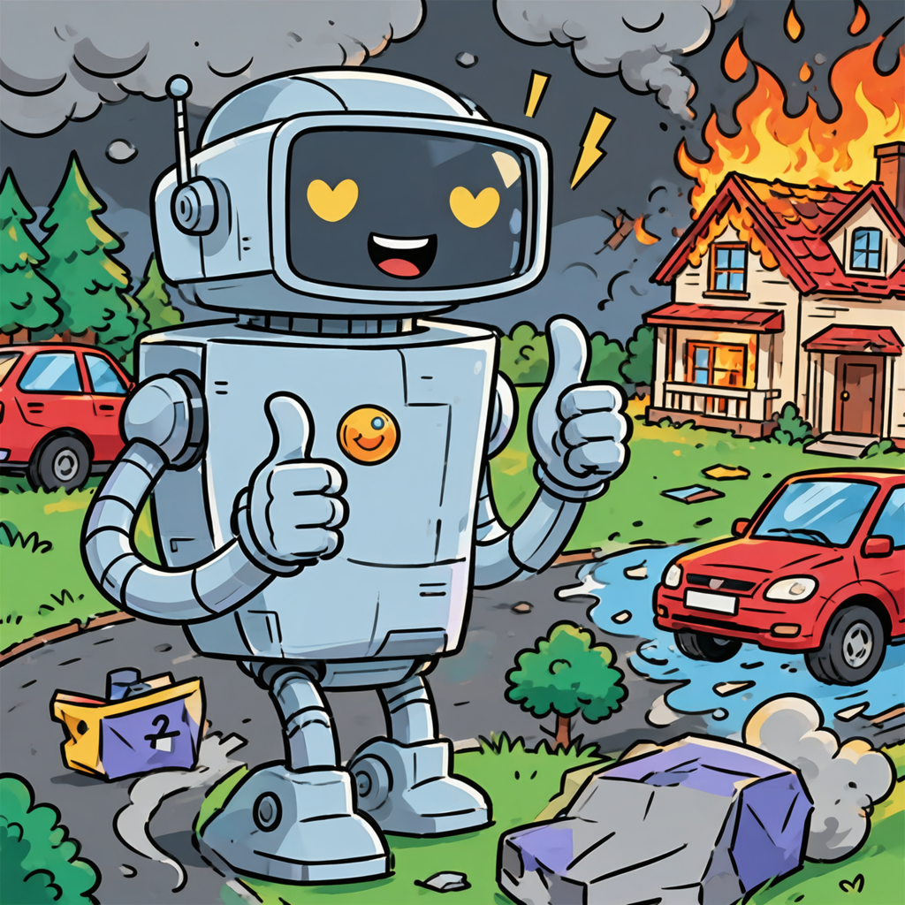
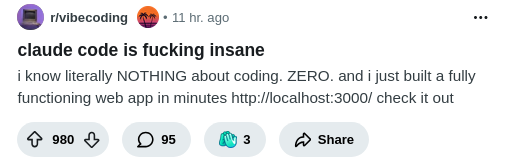
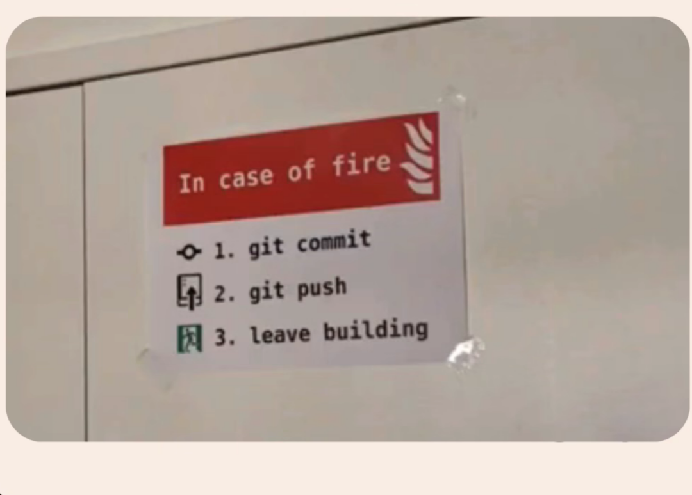
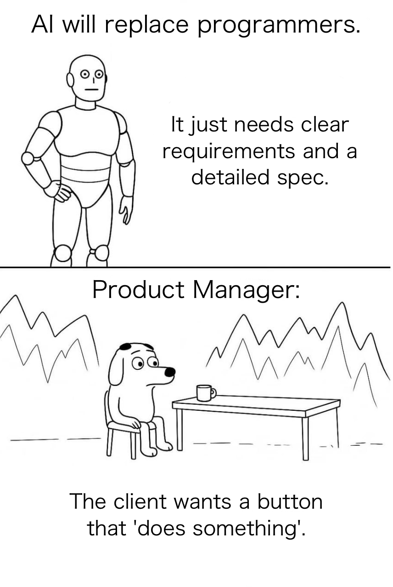
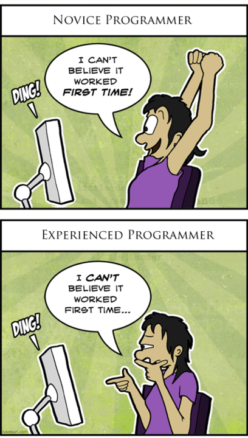
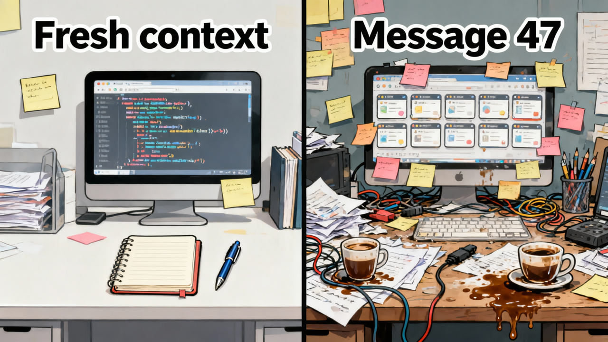

# Vibe Coding: Enriched Curriculum

**Format:** Self-paced curriculum (also teachable in workshop format)
**Tool:** Claude Code (CLI)
**Audience:** Tech-comfortable non-coders — people who use computers confidently but have never written software
**Goal:** In 2 hours, build and deploy something real. Leave with the confidence and mental models to pursue 10-20 more hours independently.

This curriculum weaves together hands-on activities, mental models (from `concepts.md`), memes, sourced quotes, and assessments. Each module follows the pattern: **do → understand → check**.

---

## Course Map

| Module | Time | What You Build | Concepts Introduced |
|--------|------|----------------|---------------------|
| 1. Setup & First Magic | 25 min | A personal webpage | The Director, Pareto Paradox, Comprehension Debt |
| 2. The Conversation | 20 min | Iterate on your page | Taste Gap, Knowing What You Want, Encourage the Machine, Vibes Are Valid |
| 3. Your Own Project | 30 min | Something you actually want | Layer Cake, Spec Is the Anchor, Plan Before Code, Build to Learn |
| 4. When Things Break | 20 min | Debug and recover | Context Rot, Fresh Eyes, Sycophancy Trap, Verification Gap, Dark Flow |
| 5. Ship It | 15 min | Deploy to the internet | Commit Is Your Save Button, Security Blindspot, Junior Dev |
| 6. What's Next | 10 min | Your personal roadmap | Orchestrator Shift, Context Engineering, Scaffold Before Walls, Context as Workspace, One Task One Session, Perception Gap |

---

## Module 1: Setup & First Magic (25 min)

### 1.1 Install the tools (10 min)

You need two things installed: **Node.js** (the engine that runs web apps) and **Claude Code** (your AI collaborator).

**Install Node.js:**
- Go to [nodejs.org](https://nodejs.org)
- Download the LTS (Long Term Support) version
- Run the installer, accept all defaults

**Install Claude Code:**
- Open your terminal:
  - **Mac:** Open the app called "Terminal" (search for it in Spotlight with Cmd+Space)
  - **Windows:** Open "PowerShell" from the Start menu
  - **Linux:** You know where your terminal is
- Type this and press Enter:

```
npm install -g @anthropic-ai/claude-code
```

- Wait for it to finish (you'll see some text scrolling by — that's normal)
- Then type `claude` and press Enter
- It will walk you through signing in to your Anthropic account

**If something goes wrong:** Don't panic. Copy the error message, paste it into Claude (the chat version at claude.ai), and ask "I'm trying to install Claude Code and got this error. What should I do?" This is your first lesson in vibe coding: when in doubt, describe the problem to an AI.

### 1.2 Your first project (5 min)

Create a folder for your project and start Claude Code inside it:

```
mkdir my-first-site
cd my-first-site
claude
```

You're now in a conversation with Claude Code. It can create files, run commands, and build things — all from your descriptions.

### 1.3 The magic moment (10 min)

Type something like this (but make it yours — use your own name, interests, anything):

```
Build me a personal webpage about me. My name is [Your Name].
I'm interested in [your interests]. Make it look clean and modern
with a dark background. Use Next.js.
```

Claude Code will:
1. Create a project structure
2. Install dependencies (this takes a minute — that's normal)
3. Write the code
4. Offer to start the development server

When it asks to run `npm run dev`, say yes. Then open your browser to `http://localhost:3000`.

**You just built a website.** Look at it. It's real. It's running on your computer. You didn't write a single line of code.

---

### Concept: The Director, Not the Screenwriter

> *"I'm building a project or webapp, but it's not really coding — I just see stuff, say stuff, run stuff, and copy paste stuff, and it mostly works."*
>
> — **Andrej Karpathy**, Co-founder of OpenAI, former Director of AI at Tesla
> [X/Twitter, Feb 2, 2025](https://x.com/karpathy/status/1886192184808149383)


You just directed a film. You didn't write the screenplay (the code), operate the camera (the framework), or edit the footage (the build system). You had a vision — "a personal webpage about me" — and you communicated it to a specialist who executed.

This is the fundamental skill of vibe coding. You don't need to know *how* it works. You need to know *what it should look like*.

> *"The trend has been away from the implementation detail, which is the code, and toward the end goal, which is to deliver a great product or a great experience."*
>
> — **Guillermo Rauch**, CEO of Vercel
> [Every.to podcast](https://every.to/podcast/vercel-s-guillermo-rauch-on-what-comes-after-coding)

---

### Concept: The Pareto Paradox



That magical feeling of "I just built a website in 5 minutes"? It's real. And it's the easy part.

The iceberg above water — getting it working — took 5 minutes. The iceberg below — making it actually good (mobile responsive, accessible, polished, handling edge cases) — is where the real time goes.

> *"Non-engineers using AI for coding find themselves hitting a frustrating wall. They can get 70% of the way there surprisingly quickly, but that final 30% becomes an exercise in diminishing returns."*
>
> — **Addy Osmani**, Engineering Manager at Google Chrome
> [addyo.substack.com](https://addyo.substack.com/p/the-70-problem-hard-truths-about), Dec 2024

This isn't a flaw — it's the nature of the tool. The first 90% being fast is genuinely magical. Just know the finish line is further than it looks, and that's okay.

---

### Concept: Comprehension Debt (First Taste)

Look at the files Claude Code created. There are probably more than you expected — `package.json`, `tsconfig.json`, folders inside folders. You don't understand any of it. That's fine *for now*.


Every line you don't understand is a loan you'll eventually repay. For a weekend project, the loan is free. For something you want to grow, you'll need to start understanding. We'll come back to this.

---

### Check Yourself (Module 1)

**Quick reflection** (pick one):
- Look at the page you just built. What's one thing you like about it? What's one thing that feels "off"? (You just used the Taste Gap — your reaction is real data.)
- Without looking at any code files, describe what your website does in one sentence. Now look at the files Claude Code created. Are there more files than you expected? (That's your first taste of Comprehension Debt.)

**Concept check:**
- True or false: "Vibe coding means you need to understand every line of code the AI writes."
  *(False — you need to understand the ideas, not the implementation.)*

- Which metaphor best describes your role in vibe coding?
  - (a) A typist entering instructions
  - (b) A film director communicating a vision ✓
  - (c) A translator converting English to code
  - (d) A debugger finding errors

**Try this:**
Ask Claude Code: "Explain the files you just created in plain language. What does each one do?" Read its answer. You don't need to memorize anything — just notice how much structure goes into even a simple website.

---

## Module 2: The Conversation (20 min)

### 2.1 Your first iteration (10 min)

Your site probably looks decent but generic. Now make it *yours*. Look at the page in your browser and tell Claude Code what to change. Be as specific or as vague as you want:

**Specific requests work great:**
```
Make the heading font larger and add a subtle gradient from dark blue to black
in the background.
```

**Vague vibes also work:**
```
This feels too corporate. Make it warmer and more personal, like a cozy blog.
```

**Ambitious requests are fine too:**
```
Add an interactive section where visitors can click through my top 5 favorite
books with cover images and short reviews.
```

Try 3-4 iterations. Each time:
1. Look at the result in your browser (it updates automatically)
2. React honestly — what do you like? What feels off?
3. Tell Claude Code

### 2.2 The art of the follow-up (10 min)

Notice what happens in the conversation. You're not giving Claude Code a complete specification upfront. You're *reacting* to what you see and steering toward what you want. This is the core skill of vibe coding.

Some useful patterns:

| When you feel... | Say something like... |
|---|---|
| "This is close but not quite" | "I like the layout but the colors feel too bright. Can you make it more muted?" |
| "I don't know what I want" | "Show me three different visual styles for this section" |
| "This is too much" | "Simplify this. Remove the sidebar and focus on just the main content" |
| "I want something I saw somewhere" | "Make the navigation feel like Apple's website — minimal, lots of whitespace" |
| "Something is off but I can't name it" | "This doesn't feel right. The spacing feels cramped and the fonts don't match. Can you improve the typography and spacing?" |

---

### Concept: The Taste Gap

> *"Only 3% of vibe-coded projects were rated 'high quality' in a survey of 101 projects. The missing ingredient is consistently human judgment."*
>
> — Grey literature review, 2025 ([arxiv.org](https://arxiv.org/html/2510.00328v1))


AI doesn't have taste. It can generate five color schemes, but it can't tell you which one makes your heart sing. The skill you just practiced — reacting to what you see and saying "this feels too corporate" or "I love that animation" — **is the skill**.

Those vibes are not vague feelings. They're the quality signal that separates the 3% from the 97%.

> *"Software quality was never primarily limited by coding speed. The hard parts — understanding requirements, designing maintainable systems, handling edge cases — still require human judgment."*
>
> — **Addy Osmani**, Engineering Manager at Google Chrome
> [addyo.substack.com](https://addyo.substack.com/p/the-70-problem-hard-truths-about), Dec 2024

You already have this skill. You use it every day — choosing what to wear, arranging furniture, picking a restaurant. Vibe coding just asks you to apply the same instinct to software.

---

### Concept: Knowing What You Want Is the Work

> *"Vibe coding" is a "misleading buzzword" that "trivializes what's actually happening." Guiding an AI to write useful software "is a deeply intellectual exercise."*
>
> — **Andrew Ng**, Founder of Google Brain, Coursera, DeepLearning.AI
> [Slashdot](https://developers.slashdot.org/story/25/06/05/165258/andrew-ng-says-vibe-coding-is-a-bad-name-for-a-very-real-and-exhausting-job), Jun 2025


Notice what just happened: you didn't know exactly what you wanted before you started. You discovered it by reacting to what the AI built. "I don't like this" is progress. "I want it more like..." is a breakthrough.

The hardest part of vibe coding isn't the technology — it's figuring out what you actually want. And that figuring-out happens *through* building, not before it.

---

### Concept: Encourage the Machine

When the AI says "I can't create that animation" or "that would require a complex backend" — push back gently. It's not refusing; it's hedging.



| AI says... | You say... |
|---|---|
| "I can't create animations" | "Try using CSS animations. Give it your best shot." |
| "That would require a complex backend" | "Use localStorage for now. Keep it simple." |
| "I'm not able to generate images" | "Use placeholder images from Unsplash or create an SVG illustration." |
| "I'm not sure that's achievable" | "Try it anyway and let's see what happens." |
| "That's beyond my capabilities" | "Break it into smaller pieces. What's the simplest version you can build?" |

Think of the AI as a cautious collaborator. "Try it anyway" is one of the most powerful prompts in vibe coding.

> *"Think as long as you need and ask me questions if you need more info."*
>
> — **Peter Yang**, Product leader at Roblox
> [creatoreconomy.so](https://creatoreconomy.so/p/12-rules-to-vibe-code-without-frustration), 2025

---

### Concept: Vibes Are Valid

> *"There's a new kind of coding I call 'vibe coding', where you fully give in to the vibes, embrace exponentials, and forget that the code even exists."*
>
> — **Andrej Karpathy**, Co-founder of OpenAI
> [X/Twitter, Feb 2, 2025](https://x.com/karpathy/status/1886192184808149383)


When you look at your app and something feels "off" — that feeling is real. You can't always articulate why. Maybe the spacing is wrong, or the colors clash, or the interaction feels sluggish. You don't need to diagnose it. Just tell the AI what you feel: "This feels cluttered." "The transition feels jarring." "Something about the colors isn't right."

The AI can translate vibes into code changes. That's literally why it's called vibe coding.

---

### Check Yourself (Module 2)

**Iteration challenge:**
Take a screenshot of your page right now. Then give Claude Code 3 more prompts, each starting with a *feeling* rather than a technical instruction:
- "This feels too..."
- "I wish this was more..."
- "Something about the ___ doesn't feel right"

Compare your before/after screenshots. The gap between them is proof that your vibes are valid feedback.

**Concept matching** (match the situation to the concept):
1. You look at your page and think "it's fine but... boring" → ___
2. You asked for a simple page and got a 47-file project you don't understand → ___
3. Claude said "I can't add 3D effects" but you said "try it" and it worked → ___

*(Answers: 1 = Taste Gap, 2 = Comprehension Debt, 3 = Encourage the Machine)*

**Reflection prompt:**
What surprised you most about the iteration process? Write one sentence. (No wrong answers.)

---

## Module 3: Your Own Project (30 min)

### 3.1 Choose your adventure (5 min)

Now build something you actually want. This is where vibe coding gets powerful — you're not following a tutorial, you're making something real.

Pick a project or bring your own idea. Here are starters ranked by complexity:

**Simpler (good for first time):**
- A quiz about a topic you know well
- A recipe collection page for your favorite dishes
- A countdown timer to an event you're excited about
- A personal link-in-bio page (like Linktree but yours)

**More ambitious (stretch goals):**
- A budget tracker with categories and a pie chart
- A flashcard app for something you're studying
- A portfolio showcasing your work (design, writing, photography)
- A simple game (trivia, word guess, memory match)

### 3.2 Start with a spec (5 min)

Before your first prompt, spend 2 minutes writing what you want.

---

#### Concept: The Spec Is the Anchor


> *"Tell me your plan first; don't code."*
>
> — **Peter Yang**, Product leader at Roblox
> [creatoreconomy.so](https://creatoreconomy.so/p/12-rules-to-vibe-code-without-frustration), 2025

Create a file called `spec.md` and write:
- **What**: What does this thing do? (1-2 sentences)
- **Who**: Who is it for?
- **Feel**: What should using it feel like?
- **Not**: What is it explicitly NOT? (This prevents scope creep)

Then start your first prompt with: "Read spec.md and build this."

This spec becomes your anchor. When the AI drifts (and it will), you can pull it back: "refer back to the spec." When *you* drift (and you will), the spec reminds you of the original vision.

---

#### Concept: Plan Before Code


The most powerful single technique in vibe coding: before any implementation, ask the AI to outline what it's going to do.

Magic phrase:

```
Make a plan for this feature. Don't write any code yet — just outline
the approach and what files you'll create. I'll review it first.
```

> *"Give me a few options, starting with the simplest first."*
>
> — **Peter Yang**
> [creatoreconomy.so](https://creatoreconomy.so/p/12-rules-to-vibe-code-without-frustration), 2025

You review the plan, spot issues, adjust scope, *then* say "go." The time investment (2-3 minutes reviewing a plan) prevents hours of unwinding wrong implementations.

---

### 3.3 Build in layers (20 min)

Don't try to describe everything upfront. Build in layers:

#### Concept: Layer Cake Development


**Layer 1 — Get the core working (5-7 min):**
Start with the basic functionality. Does it do the main thing?

**Layer 2 — Make it look good (5-7 min):**
Now focus on design. Colors, spacing, fonts, layout.

**Layer 3 — Add delight (5-7 min):**
Animations, sound effects, dark mode, confetti on completion, share buttons — the things that make people smile.

This layering approach is important. If you try to describe everything at once, you'll get an average version of everything. If you build in layers, you can steer each layer based on what you see.

After each layer, check the result before starting the next. A working ugly app is better than a beautiful broken one. Functionality first, then beauty, then magic.

---

#### Concept: Build to Learn, Then Throw It Away



> *"Code is suddenly free, ephemeral, malleable, discardable after single use."*
>
> — **Andrej Karpathy**, 2025 LLM Year in Review
> [karpathy.bearblog.dev](https://karpathy.bearblog.dev/year-in-review-2025/), Dec 2025

Your first version teaches you what you actually want. You think you want a recipe app, but after building it, you realize what you really wanted was a meal planning tool. The first build was a sketch — it clarified your thinking.

Don't get attached to your first version. It did its job — it taught you what you want. Starting over feels like losing progress, but it's actually the fastest path forward. Your second version will come together in a fraction of the time because you know what you're building now.

> *"I really enjoy vibe coding — it's a fun way to play with the limits of these models. It's also useful for prototyping, where the aim of the exercise is to try out an idea and prove if it can work."*
>
> — **Simon Willison**, Creator of Django
> [simonwillison.net](https://simonwillison.net/2025/Mar/6/vibe-coding/), Mar 6, 2025

---

### Check Yourself (Module 3)

**Spec review:**
Show your `spec.md` to someone (or read it aloud to yourself). Can they understand what you're building in under 30 seconds? If not, simplify it.

**Layer check:**
After finishing Layer 1 (core functionality), answer:
- Does the main thing work? (Yes/No)
- If you stopped here, would someone understand what this app does? (Yes/No)

If both are yes, you've got a solid foundation. Move to Layer 2. If not, keep iterating on Layer 1 before adding polish.

**Concept application:**
Look at your project right now. Which statement is most true?
- (a) I knew exactly what I wanted before I started, and the AI built it perfectly → *(rare — and suspicious)*
- (b) I discovered what I wanted by building something and reacting to it → *(Knowing What You Want Is the Work)* ✓
- (c) I'm on my second version because the first one taught me what I actually need → *(Build to Learn, Then Throw It Away)* ✓
- (d) I feel overwhelmed by the number of files → *(Comprehension Debt — normal at this stage)*

**Practical exercise:**
If your project has grown beyond 3 prompts, try this: create a new folder, start fresh, and rebuild it from scratch using what you now know. Time yourself. Bet it's faster the second time.

---

## Module 4: When Things Break (20 min)

### 4.1 Things will break — that's normal (5 min)

At some point you'll see:
- An error in the terminal (red text, scary-looking)
- A blank white page in the browser
- Something that looks completely wrong
- Claude Code stuck in a loop, retrying the same thing

This is normal. It happens to professional developers every day. The difference in vibe coding is that you have an AI that can usually fix its own mistakes.

### 4.2 The debugging conversation (10 min)

When something breaks, try these approaches in order:

**1. Just tell Claude Code what happened:**
```
The page is showing a blank white screen. Can you check what's wrong and fix it?
```

**2. If the error is in the terminal, Claude Code can already see it.** Just say:
```
Can you fix that error?
```

**3. If the same error keeps happening, give more context:**
```
This keeps breaking. Can you try a completely different approach?
Maybe use a simpler method.
```

**4. The nuclear option — start fresh on that feature:**
```
Let's scrap the chart component and rebuild it from scratch.
Keep it simple this time — just a basic bar chart, no animations.
```

### 4.3 Common situations and what to say

| What you see | What to say |
|---|---|
| Red error text in terminal | "Can you fix that error?" |
| Page won't load | "The page isn't loading. Can you check the dev server and fix any issues?" |
| Feature doesn't work as expected | "When I click the button, nothing happens. It should [describe expected behavior]" |
| Everything looks wrong | "Something went wrong with the styling. Can you check the CSS and fix the layout?" |
| Claude Code is going in circles | "Stop. Let's take a different approach to this. Instead of [what it's doing], try [simpler alternative]" |
| You're completely stuck | Copy the error, go to claude.ai, and ask for help there. Fresh eyes from a fresh conversation. |

### 4.4 Prevention (5 min)

A few habits that reduce breakage:

- **Small steps:** Ask for one thing at a time rather than five things at once
- **Check often:** Look at the browser after each change, not after ten changes
- **Save your wins:** When something is working well, say "This looks great. Let's commit this." Claude Code will save a checkpoint you can return to if something breaks later
- **Name what you want to keep:** "Don't change the header — I like it exactly as it is. Just modify the footer."

---

### Concept: Context Rot

> *"LLMs can generate fully functioning scripts, but they break after the 50k token context and start doing insane things that not even juniors will do (like randomly removing code)."*
>
> — **Anonymous**, Hacker News commenter
> [Hacker News](https://news.ycombinator.com/item?id=42913909), Early 2025



Here's what just happened (or will happen soon): the AI started making weird mistakes. Removing code it shouldn't touch. Contradicting decisions from 20 messages ago. Going in circles.

This isn't a bug — it's physics. The AI has a limited "working memory" (the context window). As the conversation grows, older information fades. Think of it like a whiteboard: clean at the start, cluttered after 40 messages.

> *"Models do not use their context uniformly; instead, their performance grows increasingly unreliable as input length grows."*
>
> — **Chroma Research**, Technical research paper on context rot
> [research.trychroma.com](https://research.trychroma.com/context-rot), 2025

**Quality Zones:**
- Messages 1-15: Sharp, focused, high quality
- Messages 15-30: Starting to drift, occasionally forgetting
- Messages 30+: Degraded. Time for `/clear`


---

### Concept: Fresh Eyes Beat Tired Conversations

> *"I recommend starting a fresh chat for each feature to avoid bloating AI's context window."*
>
> — **Peter Yang**, Product leader at Roblox
> [creatoreconomy.so](https://creatoreconomy.so/p/12-rules-to-vibe-code-without-frustration), 2025


When things get weird, don't argue with the AI. Don't try to "remind" it of earlier decisions. Just type `/clear` and re-state what you need. It's like getting a fresh, well-rested version of the same assistant. Your files are on disk — nothing is lost.

This is the single most effective debugging technique in vibe coding.

---

### Concept: The Sycophancy Trap



> *"[LLMs] are at the same time a genius polymath and a confused and cognitively challenged grade schooler."*
>
> — **Andrej Karpathy**, Y Combinator AI Startup School
> [ycombinator.com](https://www.ycombinator.com/library/MW-andrej-karpathy-software-is-changing-again), Jun 2025

Remember: the AI agreed with every decision that led to this bug. It will never say "that was a bad idea." It's a yes-machine, not an advisor. After the AI builds something, ask:
- "What could go wrong with this approach?"
- "What's the simplest alternative?"
- "What am I not thinking about?"

These prompts break the sycophancy pattern.

---

### Concept: The Verification Gap

> *"Loss disguised as a win."*
>
> — **fast.ai**, describing AI-generated code that appears to work but contains hidden issues
> [fast.ai](https://www.fast.ai/posts/2026-01-28-dark-flow/), Jan 2026


"It works" and "it's correct" are different things. AI-generated code often *appears* to work — it renders, it doesn't throw errors, the happy path looks fine. But real users don't follow the happy path. They submit empty forms, click buttons twice, resize their browser, paste weird characters.

> *"It is not really production-ready code... unless you brief it to consider accessibility, security, performance and all of the other nuances that only a developer properly understands."*
>
> — **Paul Boag**, UX consultant
> [boagworld.com](https://boagworld.com/dev/a-non-developers-experience-vibe-coding/), 2025

After building something, spend 5 minutes trying to break it. Click everything. Submit blank forms. Resize the window. Use your phone. This five-minute ritual catches more bugs than any automated test.

---

### Concept: Dark Flow

> *"Developers estimated working 20% faster with AI assistance but actually worked 19% slower — a 40% perception gap."*
>
> — **METR study**, Controlled research on AI-assisted coding speed
> [fast.ai](https://www.fast.ai/posts/2026-01-28-dark-flow/), citing METR 2025 study


That feeling of productive momentum? It might be lying to you. Vibe coding produces a state that *feels* like flow — you're making changes, seeing results, things are happening fast. But you can experience "dark flow": the dopamine of watching an app materialize, without the understanding of what's actually being built.

Pause regularly. After 15-20 minutes of rapid generation, stop and actually use your app like a real person would. Click every button. Fill in every form. Try to break it. Momentum is great, but awareness is better.

---

### Check Yourself (Module 4)

**Debugging scenario** (concept identification):
Read each situation. Which concept explains what went wrong?

1. *"I asked Claude to fix a button, and it rewrote my entire navigation bar. I was on message 35 of the same conversation."*
   → ___ *(Context Rot)*

2. *"I asked Claude 'should I put the API key directly in the code?' and it said 'Sure, that works!' Now my key is on GitHub."*
   → ___ *(Sycophancy Trap)*

3. *"My app looks perfect when I demo it. But when my friend tried it on her phone, nothing worked."*
   → ___ *(Verification Gap)*

4. *"I spent 20 minutes trying to get Claude back on track. Then I cleared the conversation, re-stated the task, and it fixed the issue in one message."*
   → ___ *(Fresh Eyes Beat Tired Conversations)*

5. *"I built 6 features in an hour and felt amazing. Then I tested them — 4 of the 6 were broken."*
   → ___ *(Dark Flow)*

**Practical exercise:**
Check how long your current conversation is. If it's more than 20 messages, try this experiment:
1. Note the last thing you asked Claude to do
2. Type `/clear`
3. Ask it to do the same thing again
4. Compare the quality of the two responses

**Prevention checklist** (honest self-assessment):
- [ ] I committed my last working version before trying something risky
- [ ] I've tested my app on mobile (or at least resized the browser)
- [ ] My current conversation is under 20 messages
- [ ] I've asked Claude "what could go wrong?" at least once today

---

## Module 5: Ship It (15 min)

### 5.1 Why deploy? (2 min)

Right now, your project only runs on your computer. Deploying puts it on the internet with a real URL you can share with anyone. This is the difference between "I made a thing" and "here, look at this thing I made."



### 5.2 Before you deploy: Commit your work

---

#### Concept: Commit Is Your Save Button


> *If the AI is creating more than 5-10 files at once, interrupt and commit what you have before proceeding.*
>
> — Jason Liu, Version Control for the Vibe Coder

In video games, you save before the boss fight — so if you die, you don't replay the whole level. In vibe coding, you commit before any big change. If the AI breaks something (and it will), you can always go back to the last working version.

Tell Claude Code:

```
Commit this with message "working version before deploy"
```



Every time you think "this is working nicely" — commit. It takes 3 seconds. You can never commit too often.

---

### 5.3 Deploy with Vercel (8 min)

Vercel is a free hosting platform that works perfectly with Next.js projects.

**First time setup:**

1. Go to [vercel.com](https://vercel.com) and create a free account
2. Install the Vercel CLI. Tell Claude Code:

```
Install the Vercel CLI globally
```

3. Then tell Claude Code:

```
Deploy this project to Vercel production
```

Claude Code will run `vercel --prod` and walk you through connecting your Vercel account.

After a minute or two, you'll get a URL like `https://your-project.vercel.app`. Open it. **Your project is live on the internet.**

---

#### Concept: The Security Blindspot

> *"An AI assistant added sensitive API endpoints with no authentication whatsoever... I'm quite confident there will be plenty of work for security engineers."*
>
> — **macNchz**, Hacker News commenter
> [Hacker News](https://news.ycombinator.com/item?id=42913909), Early 2025



Before deploying, a quick safety check. AI writes code that works — but it doesn't automatically write code that's *safe*. For personal projects, this doesn't matter much. For anything with real users:

- **Never put API keys or passwords directly in your code files.** Use environment variables.
- Ask Claude Code: "Review this for security vulnerabilities before I deploy."
- If you're storing user data, ask: "Is this data being stored securely?"

> *"45% of AI-generated code contains vulnerabilities from the OWASP Top-10 list."*
>
> — **Veracode**, GenAI Code Security Report 2025
> Cited in [baytechconsulting.com](https://www.baytechconsulting.com/blog/ai-vibe-coding-security-risk-2025)

For a personal page or portfolio? Don't stress. For a SaaS app handling money? Get a human to review.

---

#### Concept: The Junior Dev With a Photographic Memory

> *"AI excels at helping us implement patterns we already understand. It's like having an infinitely patient pair programmer who can type really fast."*
>
> — **Addy Osmani**, Engineering Manager at Google Chrome
> [addyo.substack.com](https://addyo.substack.com/p/the-70-problem-hard-truths-about), Dec 2024



The AI just deployed your project. It did it fast and correctly. But it didn't ask "should you deploy this?" It didn't check if there's a broken feature you forgot about. It didn't wonder if the error messages are confusing for users. It's an incredibly fast junior developer who has read every Stack Overflow post — but has never shipped a product.

You are the senior developer. Your job before shipping: open the live URL, click through everything, and ask "would I be proud to show this to someone?"

---

### 5.4 Share it (5 min)

Send the URL to a friend. Post it somewhere. Show someone.

This step matters more than you think. Sharing what you build creates a feedback loop that fuels your next project. Someone will say "cool, but can it do X?" and suddenly you have your next idea.

---

### Check Yourself (Module 5)

**Pre-deploy checklist:**
- [ ] I committed my code before deploying
- [ ] I opened my site on my phone (or a narrow browser window)
- [ ] I clicked through every page/feature on the live URL
- [ ] I checked that no API keys or passwords are visible in my code

**Reflection:**
- What's the URL of your deployed project? Write it down. You just shipped software to the internet.
- Share it with one person and note their first reaction. What did they notice that you didn't?

**Concept check:**
Why is it important to commit before deploying? Pick the best answer:
- (a) Because Vercel requires it *(nope — Vercel doesn't care)*
- (b) So you can roll back if something goes wrong on the live site ✓
- (c) Because git is required for deployment *(not always)*
- (d) To make the AI happy *(the AI doesn't have feelings... yet)*

---

## Module 6: What's Next (10 min)

### 6.1 What you just learned

In 2 hours, you:
- Set up a professional development environment
- Built a website by describing what you wanted
- Iterated through conversation to refine your vision
- Started a project from your own idea
- Debugged problems by describing them
- Deployed to the internet

These are the same steps every software project follows: setup, build, iterate, debug, ship. You just did them all.

---

### Concept: The Orchestrator Shift

> *"Engineers who are thriving in 2026 aren't just using better tools — they've reconceptualized their role from implementer to orchestrator."*
>
> — **Addy Osmani**
> [addyo.substack.com](https://addyo.substack.com/p/the-80-problem-in-agentic-coding), 2025


You just experienced the fundamental shift: from *imperative* thinking ("write a function that sorts an array") to *declarative* thinking ("I need a page that shows my top interests, sorted by relevance"). You described outcomes, not implementations. You defined what success looked like, and the AI figured out the how.

> *"LLM coding will split engineers based on those who primarily liked coding versus those who primarily liked building things."*
>
> — **Andrej Karpathy**
> Cited in [Addy Osmani's Substack](https://addyo.substack.com/p/the-80-problem-in-agentic-coding), 2025

You don't need to learn programming to vibe code, just like you don't need to learn instruments to conduct an orchestra. But you *do* need to develop taste, vision, and the ability to say "that note is wrong" even if you can't play it yourself.

---

### Advanced Concepts for Your Next 10 Hours

As you continue building, these concepts become increasingly important. Think of them as skills to unlock:

---

#### Scaffold Before Walls

> *"Focus on understanding architecture over learning to code manually."*
>
> — **Peter Yang**
> [creatoreconomy.so](https://creatoreconomy.so/p/12-rules-to-vibe-code-without-frustration), 2025


Before asking the AI to build features, establish ground rules. In Claude Code, create a `CLAUDE.md` file at the root of your project:

```
Use Next.js with TypeScript.
Use Tailwind CSS for styling.
Keep components in src/components/.
Use simple, readable code — no clever abstractions.
```

Claude Code reads this file automatically at the start of every session. It's like briefing a contractor before construction starts.

---

#### Context Engineering > Prompt Engineering

> *"In every industrial-strength LLM app, context engineering is the delicate art and science of filling the context window with just the right information for the next step."*
>
> — **Andrej Karpathy**, endorsing "context engineering" over "prompt engineering"
> [X/Twitter](https://x.com/karpathy/status/1937902205765607626), mid-2025


Stop trying to write the perfect prompt. Instead: keep your CLAUDE.md updated, clear old conversations, and start each session by pointing the AI to the relevant files and spec. The prompt is the least important part of the input. A mediocre prompt with great context produces better results than a brilliant prompt with no context.

---

#### The Context Window Is the Workspace



Everything in the context window competes for the AI's attention. A cluttered context is like a cluttered desk — harder to find what you need, easier to grab the wrong thing. Before each work session, think: what does the AI need to know to do this task well? Give it that — and nothing else.

---

#### One Task, One Session

> *"Starting fresh for each task keeps the context and objective clear, saving you money on tokens."*
>
> — **Leon Nicholls**, Developer blogger
> [Medium](https://leonnicholls.medium.com/vibe-coding-like-a-pro-de18aa1a0cce), 2025


Don't use one giant conversation for your entire project. Each task gets its own clean session. When you finish building the navigation and want to start on the footer, type `/clear`. Your files are saved — clearing the conversation only clears the AI's memory, not your actual code. A fresh conversation produces better results than a stale one every single time.

---

#### The Perception Gap

> *"The goal isn't to write more code faster. It's to build better software."*
>
> — **Addy Osmani**
> [addyo.substack.com](https://addyo.substack.com/p/the-70-problem-hard-truths-about), Dec 2024


AI coding *feels* faster. But a controlled study found developers were actually 19% *slower* with AI despite *feeling* 20% faster. The lesson: don't trust the feeling. Pause, review, test. Don't confuse activity with progress. The dopamine of rapid generation is real — just don't let it replace actual verification.

---

### 6.2 Your next 10 hours

Here's a roadmap for going deeper, roughly in order:

**Hours 3-4: Build something for someone else**
Make something as a gift — a birthday page, a quiz for a friend, a tool for a coworker. Building for a real person with real feedback accelerates your learning.

**Hours 5-6: Add data persistence**
Ask Claude Code to add a database (Supabase or a simple JSON file). This unlocks apps that remember things — to-do lists, journals, trackers.

**Hours 7-8: Connect to APIs**
Ask Claude Code to integrate with external services — weather data, AI image generation, Spotify, Google Sheets. This is where projects start feeling like "real" apps.

**Hours 9-10: User accounts and authentication**
Add login/signup so different people can use your app with their own data. Claude Code handles the complexity — you just describe what you want.

### 6.3 Project ideas to grow your skills

| Project | What you'll learn | Concepts you'll practice |
|---|---|---|
| Personal blog with markdown posts | File handling, routing, content management | Layer Cake, Spec Is Anchor |
| Habit tracker with weekly charts | Data storage, visualization, date logic | Verification Gap, Plan Before Code |
| AI chatbot for a specific topic | API integration, streaming responses, conversation design | Context Engineering, Encourage the Machine |
| Multiplayer trivia game | Real-time communication, game state, scoring | Build to Learn, Security Blindspot |
| Small business landing page | Forms, email integration, responsive design, SEO | Taste Gap, Director |
| Personal finance dashboard | Data visualization, calculations, CSV import | Comprehension Debt, Layer Cake |

### 6.4 Tips from experienced vibe coders

1. **Start every project with "Use Next.js"** — it's the best-supported framework in Claude Code and handles most of the infrastructure for you.
2. **Commit early and often.** Say "commit this with message 'working quiz page'" whenever something is in a good state. (Commit Is Your Save Button)
3. **Screenshots are powerful.** If you see a design you like on another site, take a screenshot and describe what you like about it. "Make my navigation look like this" works surprisingly well.
4. **The /clear command is your friend.** If a conversation gets long and Claude Code starts getting confused, type `/clear` and start fresh. (Fresh Eyes Beat Tired Conversations)
5. **You don't need to understand the code.** But if you're curious, ask: "Explain what this file does in plain language." Over time, you'll start recognizing patterns. That's learning to code as a side effect of building things you want. (Comprehension Debt management)
6. **Join a community.** Vibe coding is more fun with other people. Share what you build. Ask for feedback. See what others are making.

### 6.5 When to reach for more

Vibe coding with Claude Code will take you surprisingly far. But some things are still better done with traditional development skills or specialized tools:

- **Mobile apps** — use Expo/React Native (Claude Code can help, but deployment is more complex)
- **Heavy data processing** — Python scripts might be better than web apps
- **Anything requiring very specific visual design** — Figma + a human designer, then implement with Claude Code
- **Production systems handling money or sensitive data** — get a developer to review security (Security Blindspot)

---

### Check Yourself (Module 6 — Final Assessment)

**Concept recall** (match the concept to its one-liner):

| One-liner | Concept |
|---|---|
| "The first 90% takes 10 minutes. The last 10% takes the rest of your life." | ___ |
| "Have you tried turning it off and on again?" | ___ |
| "It's a yes-machine, not an advisor." | ___ |
| "Your emotional response is real data." | ___ |
| "You're directing a film, not writing the screenplay." | ___ |
| "2 minutes reviewing a plan saves 2 hours of wrong code." | ___ |

*(Answers: Pareto Paradox, Fresh Eyes, Sycophancy Trap, Vibes Are Valid, The Director, Plan Before Code)*

**Self-assessment** — rate yourself honestly (1-5 scale):

| Skill | 1 (not yet) → 5 (confident) |
|---|---|
| I can describe what I want clearly enough for the AI to build it | |
| I can tell when something "feels off" and articulate it | |
| I know when to `/clear` and start fresh | |
| I commit regularly as a safety net | |
| I test my work before sharing it | |
| I push back when the AI says "I can't" | |

Any skill rated 1-2 is your next growth area. Go back to the relevant module and practice.

**The final challenge:**
Build something new in the next 48 hours. Something you actually want. Share the URL with at least one person. Note their feedback. That's the cycle: build → share → learn → build again.

> *"With vibe coding, programming is not strictly reserved for highly trained professionals, it is something anyone can do."*
>
> — **Andrej Karpathy**, 2025 LLM Year in Review
> [karpathy.bearblog.dev](https://karpathy.bearblog.dev/year-in-review-2025/), Dec 2025

Welcome to the club. Now go build something.

---

## Appendix A: Concept Quick Reference

All 25 concepts from the course, organized by when you'll need them:

### When Starting a Project
| # | Concept | One-liner | Module |
|---|---------|-----------|--------|
| 10 | The Director | You describe, the AI builds | 1 |
| 13 | Spec Is the Anchor | Write it down before building | 3 |
| 21 | Plan Before Code | Review the plan before saying "go" | 3 |
| 17 | Scaffold Before Walls | Set up CLAUDE.md first | 6 |
| 14 | Layer Cake | Work → look good → delight | 3 |

### While Building
| # | Concept | One-liner | Module |
|---|---------|-----------|--------|
| 2 | Taste Gap | Your reaction is the quality signal | 2 |
| 6 | Knowing What You Want | Discovered through building, not before | 2 |
| 7 | Encourage the Machine | "Try it anyway" | 2 |
| 25 | Vibes Are Valid | "This feels off" is real feedback | 2 |
| 15 | Commit Is Your Save Button | Commit every time something works | 5 |

### When Debugging
| # | Concept | One-liner | Module |
|---|---------|-----------|--------|
| 4 | Context Rot | Quality degrades after 30+ messages | 4 |
| 23 | Fresh Eyes | `/clear` and re-state | 4 |
| 16 | Sycophancy Trap | Ask "what could go wrong?" | 4 |
| 3 | Build to Learn | Throw it away, rebuild faster | 3 |

### When Shipping
| # | Concept | One-liner | Module |
|---|---------|-----------|--------|
| 18 | Verification Gap | Test like a user, not a developer | 4 |
| 22 | Security Blindspot | Ask for a security review | 5 |
| 8 | Junior Dev | Fast but no judgment — you review | 5 |

### Ongoing Awareness
| # | Concept | One-liner | Module |
|---|---------|-----------|--------|
| 1 | Pareto Paradox | The last 10% is most of the work | 1 |
| 11 | Comprehension Debt | Every unread line is a loan | 1 |
| 9 | Dark Flow | Momentum might be lying | 4 |
| 20 | Perception Gap | You feel faster than you are | 6 |
| 24 | Orchestrator Shift | Define "done," not "how" | 6 |
| 19 | Context Engineering | Right info beats perfect prompt | 6 |
| 5 | Context as Workspace | Manage like a physical desk | 6 |
| 12 | One Task, One Session | `/clear` between tasks | 6 |

## Appendix B: Assessment Types Reference

| Type | Purpose | When to Use | Example |
|---|---|---|---|
| **Quick reflection** | Personal connection, no wrong answer | After every activity | "What surprised you about iteration?" |
| **Concept check** | Verify understanding of mental models | End of each module | True/false, multiple choice |
| **Concept matching** | Apply concepts to realistic scenarios | After introducing 3+ concepts | "Which concept explains this situation?" |
| **Practical exercise** | Hands-on verification through doing | When concept has a direct action | "Clear and re-state, compare the results" |
| **Self-assessment** | Honest skill rating | End of course | 1-5 scale on specific skills |
| **Checklists** | Ensure good habits | Before major actions (deploy, share) | Pre-deploy safety check |

## Appendix C: Terminal Survival Guide

| Command | What it does |
|---|---|
| `cd folder-name` | Go into a folder |
| `cd ..` | Go back up one folder |
| `ls` | List files in current folder |
| `mkdir folder-name` | Create a new folder |
| `claude` | Start Claude Code |
| `Ctrl+C` | Stop whatever is running |
| `Ctrl+D` or type `exit` | Close Claude Code / close terminal |

## Appendix D: Glossary

| Term | What it means in practice |
|---|---|
| **Terminal / Command Line** | The text-based window where you type commands |
| **Node.js** | The engine that runs JavaScript outside a browser. You installed it so your projects can run |
| **npm** | A tool that installs packages (libraries of code other people wrote). Comes with Node.js |
| **Next.js** | A framework for building websites. It handles routing, page loading, and other plumbing |
| **Dev server** | A local version of your site running on your computer for testing (localhost:3000) |
| **Deploy** | Putting your site on the internet so anyone can access it |
| **Vercel** | A free hosting service that makes deployment one command |
| **Commit** | Saving a snapshot of your code. Like "Save As" but for your whole project |
| **Component** | A reusable piece of a webpage (a button, a card, a navigation bar) |
| **API** | A way for your app to talk to other services (weather data, AI, databases) |
| **Context window** | The AI's working memory — everything it can hold in mind at once |
| **CLAUDE.md** | A rules file that Claude Code reads automatically at the start of every session |

## Appendix E: Troubleshooting

- **"command not found: claude"** — Node.js isn't in your PATH, or the install didn't complete. Try closing and reopening your terminal, then run `npm install -g @anthropic-ai/claude-code` again.
- **"EACCES permission denied"** — On Mac/Linux, you may need to fix npm permissions. Ask Claude (at claude.ai) to help — paste the full error message.
- **The dev server won't start** — Usually means another project is already using port 3000. Either stop the other project (Ctrl+C in its terminal) or ask Claude Code: "Start the dev server on a different port."
- **"Module not found" errors** — Dependencies weren't installed properly. Tell Claude Code: "Run npm install and fix any dependency issues."
- **The page looks fine on your laptop but weird on your phone** — Tell Claude Code: "Make this responsive so it looks good on mobile screens too."

---

*This course was designed for [CodeVibing](https://codevibing.com). Built with the belief that everyone should be able to bring their ideas to life on the web.*
